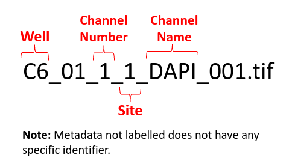

# Download NF1 Schwann Cell Images
Information regarding the data for the NF1 project are as follows:

```
Assay: Modified Cell Painting

Channels: DAPI (DNA/Nuclei), GFP (Endoplasmic Reticulum), RFP (Cytoplasm) 

Cells: Schwann cells

Samples: Two genotypes of the NF1 gene, WT +/+ and Het +/-

Microscope: GE Deltavision Elite

Magnification: 20X

Bit-size: 16-bit

Number of images: 96 images

Total memory: 212.9 MB
```

## File Name Structure: 

