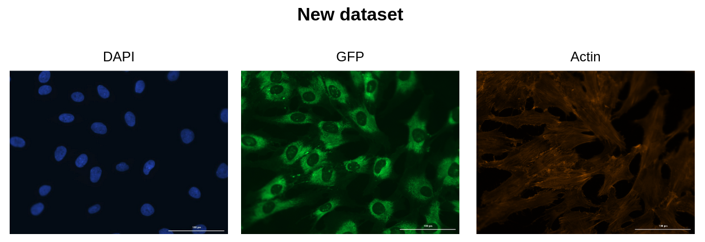

# Download NF1 Schwann Cell Images

In this module, we present the two datasets, pilot and new, that are downloaded to perform image-based cell profiling.

## NF1 Project Information

Information regarding the data for the NF1 project are as follows:

```
Assay: Modified Cell Painting

Channels: DAPI (DNA/Nuclei), GFP (Endoplasmic Reticulum), RFP (Cytoplasm) 

Cells: Schwann cells

Samples: Two genotypes of the NF1 gene, WT +/+ and Null -/-

Microscope: GE Deltavision Elite

Magnification: 20X

Bit-size: 16-bit

Number of images: 

- 96 images (Pilot dataset)

- 384 images (New dataset)

Total memory: 

- 212.9 MB (Pilot dataset)

- 204.2 MB (New dataset - post conversion and cropping)
```

## File Name Structure


## Issue with new dataset

When comparing the pilot dataset and the second plate dataset, there were three big differences between them:

1. Image composition
2. File naming (metadata)
3. File extension/type

Firstly, the images from the second plate were RGB and contained a scale (Figure 1).



The images from the pilot dataset are greyscale (which is the standard), no scale, and are 8-bit (Figure 2). 


Secondly, since the code within this project relies on the metadata structure from the pilot data (see above), the second plate would not be able to run properly.

Thirdly, the images from DAPI channel in the new dataset are all `.jpg` and not in `.tif`, which is not consistent with the pilot dataset.
Both the Actin and GFP channel images are all `.tif` files.

## Solution

This led to the need for a solution to correct the second plate dataset to reflect the standard from the pilot dataset. 
The corrections include using CellProfiler and Python. 
In CellProfiler, we split the RGB images into three greyscale images (called red, green, and blue), taking the one of the three images that is connected to the channel (e.g. DAPI is the blue channel, GFP is green, RFP is red), and cropping the images to remove the scale.
The cropped images from each channel are saved as `.tif` files.

**Note:** After conversion and cropping, we noticed that all the images from the DAPI channel are pixelated while the other channels are not. This is believed to be due to the conversion of the images from `.jpg` to `.tif`. It is unknown how this will impact the morphological readouts. 

Lastly, using Python, we created a function to reorder the file names and add metadata to fit the standards for analysis downstream.

---

## Steps to perform the conversion and correction of new dataset

### Step 1: Create conda environment

```sh
# Run this command to create the conda environment for NF1 segmentation
conda env create -f 0.download_NF1_data.yml
```

### Step 2: Activate conda environment

```sh
# Run this command to create the conda environment for NF1 segmentation
conda activate download-NF1-data
```

## Step 3: Set input and output paths for running CellProfiler and correcting file names

If needed, you can change the paths within the []

## Step 4: Execute preprocessing NF1 data

```bash
# Run this script in terminal to segment NF1 data
bash 1.preprocessing_data.sh
```
