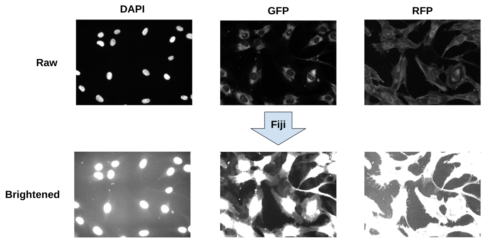
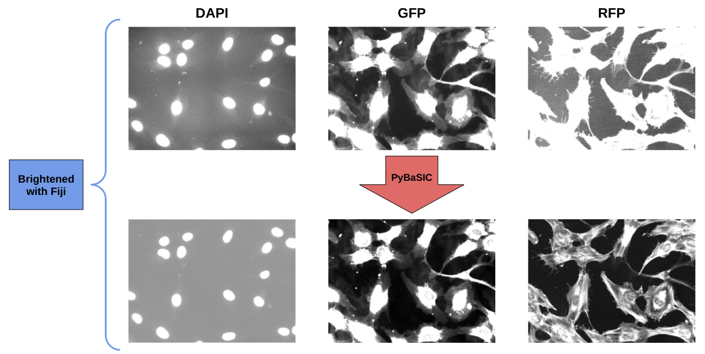
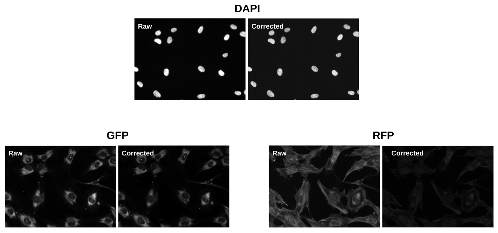

# 1. Preprocessing NF1 Data

In this module, we present our pipeline for preprocessing the NF1 Schwann Cell data.

## Illumination Correction (IC)

To correct for illumination issues within the NF1 data, we use the BaSiC method that was established in an article by [Peng et al.](https://doi.org/10.1038/ncomms14836).
We specifically use the Python implementation of this method, called [PyBaSiC](https://github.com/peng-lab/BaSiCPy).

Illumination correction is an important step in cell image analysis pipelines as it helps with downstream processes like segmentation (more accuracy in segmenting shape and identifying objects to segment) and feature extraction (accurate measurements in intensity, texture, etc.).

Being able to visualize if images need IC can be very easy or very hard depending on the dataset. 
In the NF1 dataset, the raw images are impossible to tell with the human eye that there are any illumination issues.

To be able to see illumination issues within the images, we use Fiji to increase the maximum limits of the display range to brighten the image using the `B&C` function (Figure 1).


> Figure 1. Use of Fiji to Determine Illumination Issues. This figure shows how increasing the maximum limit for the display range reveals illumination issues (e.g. vignetting like in the DAPI channel). The increasing of the upper limits for display starts to show where there is brighter areas in the image that was hidden when the upper limit was lower.

The documentation regarding this function states:

> ImageJ displays images by linearly mapping pixel values in the display range to display values in the range 0-255. Pixels with a value less than the minimum are displayed as black and those with a value greater than the maximum are displayed as white. `Minimum` and `Maximum` control the lower and upper limits of the display range.

After running PyBaSiC and outputting corrected images, Fiji can be used once again to be able to visualize if the illumination issues been corrected (Figure 2).


> Figure 2. Visualizing IC Through Comparison. This figure shows how impactful illumination correction using PyBaSiC is on the raw images. 

Without using Fiji, the raw and corrected images look almost exactly the same and there is no way to tell (with the human eye) if the illumination issues have been corrected. (Figure 3).


> Figure 3. Raw versus Corrected Images. This figure shows how only looking at the images without any editing does not give any indication if the IC worked or not.

--- 

## Step 1: Install PyBaSiC

Clone the repository into 1_preprocess_data/ with 

```console
git clone https://github.com/peng-lab/PyBaSiC.git
```

**Note:** This implementation does not have package support which means that it can not be imported as you normally would. 
To correct for this, use this line of code within your "Importing Libraries" cell to be able to use the functions within the 
[notebook](PyBaSiC_Pipelines/Illumination_Correction.ipynb).

```console
import sys
sys.path.append("./PyBaSiC/")
import pybasic
```

## Step 2: Install Fiji

Follow the instructions on the [ImageJ website](https://imagej.net/software/fiji/downloads) to install Fiji.
We use the 64-bit Linux install.
