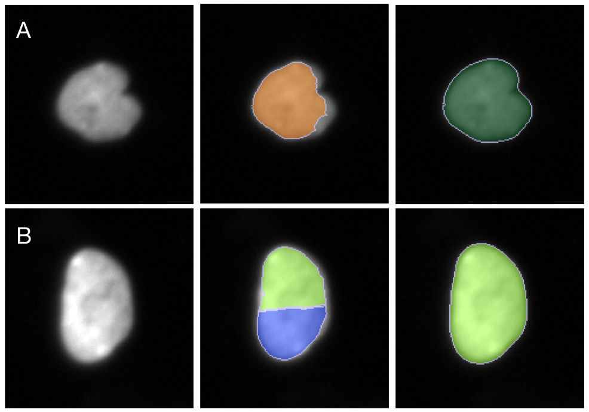
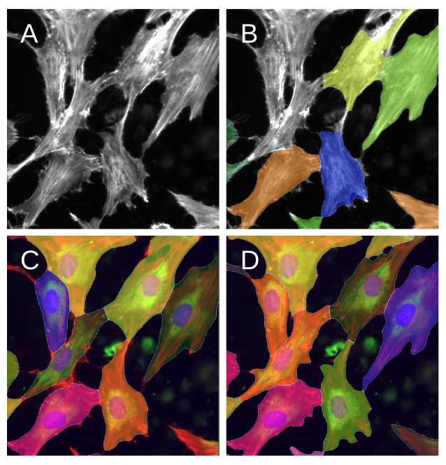
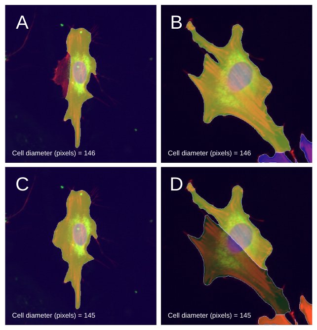

# 2. Segment NF1 Data

In this module, I present the pipeline for segmenting nuclei and cytoplasm from the NF1 pilot data.

## Segmentation

The method used for segmentation for both the nuclei and cytoplasm is an algorithm called [Cellpose](https://doi.org/10.1038/s41592-020-01018-x). 
Through the Python implementation of this method, this pipeline can be reproducible and is easy to manipulate for various datasets.

## Nuclei Segmentation

After experimenting with the various parameters in Cellpose on all of the pilot NF1 DAPI (nuclei) channel images, I settled on the following parameters for CellPose nuclei segmentation:
- `model_type : "cyto"` This parameter sets the model for Cellpose to use as the cytoplasm model, which I found segments nuclei better than the established nucleus model. 
More information about the various CellPose models can be found at https://cellpose.readthedocs.io/en/latest/models.html.
- `channels : [0,0]` This parameter sets the channels to be used by the model to segment, which in the case of nuclei, there is no need to set channels because the images are greyscale.
- `diameter : 50` This parameter sets the cell diameter for cells within the image to an extact value. 
This can also be calculated using the `calculate` button in the CellPose GUI. 
I found that the segmentation worked better when the diameter was established with a set value. 
- `flow_threshold : 0` This paramenter decreases the maximum allowed error of the flows for each mask (default is `flow_threshold : 0.4`).
- `remove_edge_masks : True` This parameter removes any masks from CellPose that are touching an edge of the image.

To show how I determined the best parameters for nuclei segmentation, below is a figure showing two rows of nuclei, with an image of the nuclei without segmentation (left), a segmented nuclei using non-optimal parameters (middle), and a properly segmented nuclei (right). 



For **nucleus A**, you can see that it is not completely circular and has an prominent indent. 
In the middle (non-optimal) image, these parameters cut off parts of the nucleus from being apart of the cell. 
In the right image, the parameters I used segment this nucleus where it includes all of the cell and keeps its shape. 

For **nucleus B**, it has a smooth and continuous texture with no dark lines indicating two seperate nuclei. 
In the middle (non-optimal) image, these parameters seperate this one nucleus into two nuclei, which is obviously wrong based on how the nuclei looks. 
In the right image, the parameters I used properly segmented the nucleus as one nucleus.

## Cytoplasm Segmentation

After experimenting with the various parameters in Cellpose on all of the pilot NF1 RFP channel images, I found that CellPose struggled with trying to segment cytoplasm with only this channel.
From this, I decided it was best to overlay the channels into one image per site for cytoplasm segmentation.
I settled on the following parameters for Cellpose cytoplasm segmentation:
- `model_type : "cyto2"` This parameter sets the model from Cellpose to be used as the cytoplasm 2 model, which I found segments cytoplasm better than the other models.
- `channels : [1,3]` This parameter sets the channels to be used by the model to segment the cytoplasm of the cells using the nuclei as the base (1: blue) and the RFP channel as the channel to be segmented (3: red).
Since Cellpose struggled with segmenting cytoplasm using only the RFP channel, I use a function to overlay nuclei, ER, and cytoplasm channels into one image from each well and site called `overlay_channels()` in [segmentation_utils.py](segmentation_utils.py).
ER channel is not used by Cellpose during segmentation as CellPose can only use 2 channels, one as a base and one to segment.

**Note:** The channel numbers correspond to the Cellpose channel colors.
The `overlay_channels()` function makes cytoplasm the red channel of the image and nuclei the blue channel of the image.
Thus, `channels : [1,3]` has CellPose segment the cytoplasm channel (3: red) using the nuclei channel (1: blue) as its base.

- `cell diameter : 146` This parameter sets the cell diameter of the cells within the image to a value, which can be calculated using the `calculate` button. 
I found that the segmentation worked better when the diameter was established with a set value.
- `flow_threshold : 0.4` This paramenter decreases the maximum allowed error of the flows for each mask (default is `flow_threshold : 0.4`).
- `remove_edge_masks : True` This parameter removes any masks from Cellpose that are touching an edge of the image.

To show how I determined the best parameters for cytoplasm segmentation, below is a figure showing a cropped image of cells from the cytoplasm channel (**panel A**) and various cytoplasm segmentation methods. 



In **panel B**, it shows how Cellpose does with only segmenting cytoplasm using the greyscale image from the RFP channel.
Since it has no indication of what is a cell, it struggles with any parameters for properly segment cytoplasm, which this image is an example of one set of parameters.

In **panel C**, this shows how Cellpose segments the cytoplasm with non-optimal parameters and with the channels overlayed into a single image. 
As seen with the cell with the orange filter, these parameters oversegments the cell and does not keep the shape of that cell. 
As well, with the green filtered cell to the left of the orange cell, Cellpose undersegments this cell and does not include a lot of the cytoplasm within the outlines. 

In **panel D**, this image shows the parameters I used to segment the cytoplasm.
These parameters worked the best for all images and it did the best in segmenting each cell without over or undersegmenting. 

## "Non-Optimal Paramters", Important Information Regarding CellPose Parameters

The term "non-optimal parameters" is very vague, especially since there are only a few parameters within CellPose to set. 
After much experimentation and prototyping, I found that the `cell diameter` parameter was the most critical when finding the best parameters. 
Secondarily, `model` is very important as a first step to find which model is actually finding your objects, but in this case, I am dicussing how important `cell diameter` is within a `model` that I found to work the best with my data. 
Even one pixel can make a huge difference for different cells from different images, as shown in the figure below.



Though there are other parameters to change that can help with segmentation, the `cell diameter` parameter is what makes or breaks a set of parameters. 
In some cases, one value for this parameter works best for images from one pertubation or genotype and not for the other(s). 

In the case for the NF1 data, there is no pattern for genotype images working better with one value or another. 
Segmentation is a balancing game where you have to give and take.
In my case, I chose to go with a `cell diameter = 146` since it worked better for the majority of images compared to `cell diameter = 145`.

## Linking Cells with Cell IDs

In this pipeline, after finding the nuclei center coordinates and the cytoplasm outlines, the next step is to determine which nuclei and cytoplasms are related.
This will be helpful during the analysis steps later in this project.

First, a `Cell_ID` to is assigned to every cytoplasm using the `index` column.

Then, using [matplotlib.path](https://matplotlib.org/stable/api/path_api.html), this function forms a polygon based on the cytoplasm outlines.

If a nucleus' center coordinates are within the a cytoplasm polygon, they are assigned the same `Cell_ID` as the cytoplasm.
If there is any cytoplasm (cell) without a nucleus assigned to it, then that cytoplasm is discarded from the file, which controls for segmentation errors.

---

## Step 1: Setup Segmentation Environment

### Step 1a: Create Segmentation Environment

```sh
# Run this command to create the conda environment for NF1 segmentation
conda env create -f 2.segmenting_data.yml
```

### Step 1b: Activate Segmentation Environment

```sh
# Run this command to activate the conda environment for NF1 segmentation
conda activate 2.segment-NF1-data
```

### Step 1c: Complete PyTorch GPU Setup

It has been established through mutliple projects within the lab that CellPose works best when using PyTorch GPU. To install and set up PyTorch GPU, follow [these instructions](https://github.com/MouseLand/cellpose#gpu-version-cuda-on-windows-or-linux). 
PyTorch GPU is being used to segment the NF1 data.

My computer uses two NVIDIA GeForce RTX 3090 with the following specifications:

```
+-----------------------------------------------------------------------------+
| NVIDIA-SMI 470.129.06   Driver Version: 470.129.06   CUDA Version: 11.4     |
|-------------------------------+----------------------+----------------------+
| GPU  Name        Persistence-M| Bus-Id        Disp.A | Volatile Uncorr. ECC |
| Fan  Temp  Perf  Pwr:Usage/Cap|         Memory-Usage | GPU-Util  Compute M. |
|                               |                      |               MIG M. |
|===============================+======================+======================|
|   0  NVIDIA GeForce ...  Off  | 00000000:2D:00.0 Off |                  N/A |
| 82%   72C    P8    43W / 420W |   3543MiB / 24265MiB |      2%      Default |
|                               |                      |                  N/A |
+-------------------------------+----------------------+----------------------+
|   1  NVIDIA GeForce ...  Off  | 00000000:2E:00.0  On |                  N/A |
| 72%   74C    P8    45W / 420W |    110MiB / 24268MiB |     13%      Default |
|                               |                      |                  N/A |
+-------------------------------+----------------------+----------------------+
```

**Note:** Only one GPU was used to run Cellpose.

## Step 2: Define Data Paths

Inside the notebook [Segmentation_Pipeline.ipynb](Segmentation_Pipeline.ipynb), the variables `data_path` and `save_path` need to be changed to reflect your desired load/save locations for the data.

## Step 3: Execute NF1 Data Segmentation

```bash
# Run this script in terminal to segment NF1 data
bash 2.segment_NF1_data.sh
```
