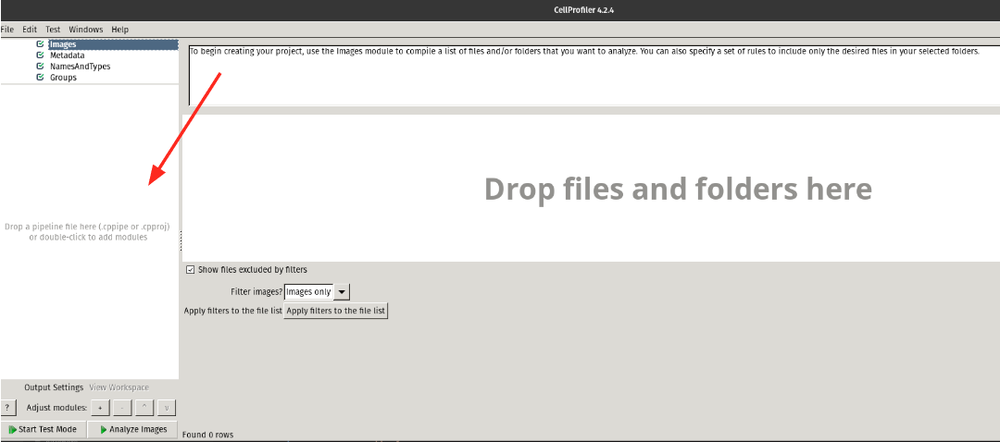
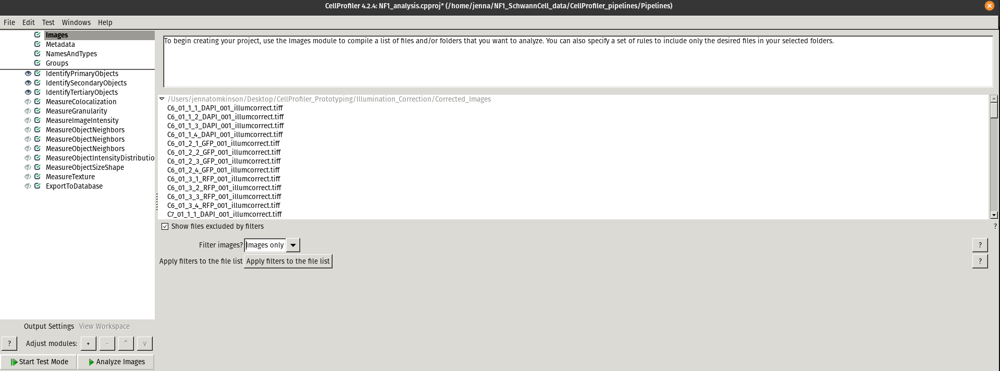

# CellProfiler Pipelines for NF1 Data Analysis

In this module, I present my CellProfiler (CP) pipelines used for illumination correction, segmentation, and feature extraction.

Since there are multiple methods are performing each of these steps, I decided to create two pipelines using [CellProfiler](https://cellprofiler.org/), version [4.2.4](https://cellprofiler-manual.s3.amazonaws.com/CellProfiler-4.2.4/index.html), a very commonly used and robust software for cell image analysis.
The goal of having multiple pipelines using various methods will allow for benchmarking for the "best" method later on. 

## Illumination Correction (IC) Pipeline

In the [NF1_illum.cpproj](Pipelines/NF1_illum.cpproj) CP project, I perform illumination correction on each channel (DAPI, GFP, RFP) of the NF1 data. 
There are three sets of `CorrectIlluminationCalculate` and `CorrectIlluminationApply` modules, where each set corrects a different channel and each contains different set of parameters as I have found using the same parameters for each channel does not always work.

For more information regarding these modules, you can reference my [Illumination Correction prototyping README](https://github.com/WayScience/CellProfiler_Prototyping/tree/main/1.illumination_correction) within the [CellProfiler_Prototyping repo](https://github.com/WayScience/CellProfiler_Prototyping). 
This README describes each of the parameters within these modules and provides further references.

Since the NF1 pilot data is small, this IC pipeline saves all of the images to use in the next pipeline.
For much larger datasets, it is standard to save the illumination correction function (which is much smaller and saves storage) and use that to perform IC in the next pipeline.

## Analysis Pipeline

In the [NF1_analysis.cpproj](Pipelines/NF1_analysis.cpproj) CP project, I perform segmentation and feature extraction.

### Segmentation

To perform segmentation in CP, the modules that were used were:

- `IdentifyPrimaryObjects` Identify nuclei from the DAPI channel images. This creates a group for an object called `OrigNuclei`, which includes nuclei that are a part of cells that touch an edge of the image.

- `IdentifySecondaryObjects` Identify whole cells using the nuclei from the previous module as a base from the RFP channel (stained for actin) images. 
These whole cells make up the object group called `Cells`.
Any cells that are touching at least one edge of the image will be removed along with its respective nucleus. 
This creates a new object group call `Nuclei`.

- `IdentifyTeritaryObjects` Identify cytoplasm by subtracting out the "smaller identfied objects" (`OrigNuclei`) from the "larger identified objects" (`Cells`). 
`OrigNuclei` has to be used in this module over `Nuclei` due to an error downstream in the pipeline when using the latter object where it states "Cytoplasm is not in a 1:1 relationship with other objects".
This means that the number of cytoplasm is not the same as the other objects, which would be wrong because there should be the same amount of objects (e.g the number of cells should match the number of cytoplasm and nuclei).

Based on my understanding of CellProfiler, these modules identify the objects and create masks for each of them to use for feature extraction.

### Feature Extraction

By using the object masks, each module runs through each image from every channel to extract features from.
I followed the format of one of the CP pipelines from the [Broad Institute Platform Pipelines](https://github.com/broadinstitute/imaging-platform-pipelines/blob/master/cellpainting_UMUC9_20x_phenix_bin2/analysis_without_batchfile.cppipe).
The following modules were used:

- `MeasureColocalization`

- `MeasureGranularity`

- `MeasureImageIntensity`

- `MeasureObjectNeighbors`

- `MeasureObjectIntensityDistribution`

- `MeasureObjectSizeShape`

- `MeasureTexture`

For further information on each of these modules, see the [Measurement section](https://cellprofiler-manual.s3.amazonaws.com/CellProfiler-4.2.1/modules/measurement.html) of the CellProfiler manual.

## Step 1: Setup CellProfiler Environment

### Step 1a: Create Environment
 
 I used this [.yml file format](https://github.com/CellProfiler/CellProfiler/wiki/Conda-Installation) from the Wiki. I updated the file and the Wiki page so that it would pip install the newest verison of CellProfiler instead of the older version that it had before.

 ```sh
# Run this command in terminal to create the conda environment for CellProfiler
conda env create -f download_cellprofiler.yml
```

### Step 1b: Activate Environment

```sh
# Run this command in terminal to activate the conda environment for CellProfiler
conda activate cp4
```

## Step 2: Open CellProfiler

```sh
# Run this command in terminal to start CellProfiler
cellprofiler
```

## Step 3: Run `illum.cpproj` and `analysis.cpproj`

`illum.cpproj` will be run first before running `analysis.cpproj`.
The same steps in order below will be followed for each project.

When CellProfiler is open, you will drag the CP project file from your file explorer into the box on the CellProfiler interface, as shown below:



After the project is loaded in, it will look like the image below:



Make sure that the `Images` module contains all of the NF1 images like the above image shows before proceeding.
To run the illumination correction pipeline, press `Analyze Images` at the bottom right.

**Note:** If you do not want to see the pop ups from each module in the pipeline, you can have the `eye symbol` turned off, like seen in the image above for all modules underneath `IdentifyTeritaryObjects`. 
This is done by just pressing that symbol to turn it on or off depending on what modules you want to view.
All of the segmentation modules are turned on as to view how the parameters are working.

The output of the entire pipeline (from IC to Analysis) is an SQLite file that will be used for preprocessing in the next module.