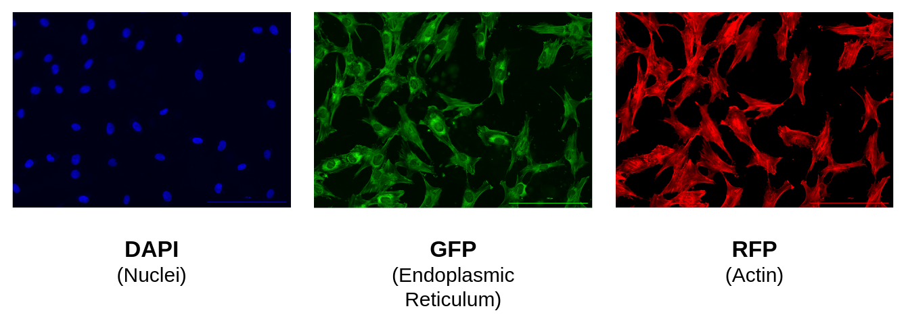

# NF1 Schwann Cell Data Project

## Data

The data used in this project is a modified Cell Painting assay on [Schwann cells](https://www.ncbi.nlm.nih.gov/books/NBK544316/) from patients with [Neurofibromatosis type 1 (NF1)](https://medlineplus.gov/genetics/condition/neurofibromatosis-type-1/). 
In this modified Cell Painting, there are three channels:

- `DAPI` (Nuclei)
- `GFP` (Endoplasmic Reticulum)
- `RFP` (Actin)

There are two genotypes of the NF1 gene in these cells:

- Wild type (`WT +/+`): In column 6 from the plate (e.g C6, D6, etc.)
- Null (`Null -/-`): In column 7 from the plate (e.g C7, D7, etc.)

It is important to study Schwann cells from NF1 patients because NF1 causes patients to develop neurofibromas, which are red bumps on the skin (tumors) that appear due to the loss of Ras-GAP neurofibromin. 
This loss occurs when the NF1 gene is mutated (NF1 +/-).

## Goal

The goal of this project is to predict NF1 genotype from Schwann cell morphology. 
We apply cell image analysis to Cell Painting images and use representation learning to extract morphology features.
We will apply machine learning to the morphology features to discover a biomarker of NF1 genotype.
Once we discover a biomarker from these cells, we hope that our method can be used for drug discovery to treat this rare disease.

## Repository Structure

| Module | Purpose | Description |
| :---- | :----- | :---------- |
| [0_download_data](0_download_data/) | Download NF1 pilot data | Download images from each of NF1 dataset (e.g. pilot and second plate) for analysis|
| [1_preprocessing_data](1_preprocessing_data/) | Perform Illumination Correction (IC) | Use `BaSiCPy` to perform IC on images per channel |
| [2_segmenting_data](2_segmenting_data/) | Segment Objects | Perform segmentation using `Cellpose` and outputing center (x,y) coordinates for each object |
| [3_extracting_features](3_extracting_features/) | Extract features | Use center (x,y) coordinates in `DeepProfiler` to extract features from all channels |
| [4_processing_features](4_processing_features/) | Normalize CellProfiler features | Use `Pycytominer` functions to merge and normalize features acquired from CellProfiler |
| [CellProfiler_pipelines](CellProfiler_pipelines/) | Perform a full pipeline on NF1 data using CellProfiler (from IC to feature extraction) | We run two `CellProfiler` pipelines (1. illumination correction and 2. segmenation and feature extraction) |
| TBD | TBD | TBD |
